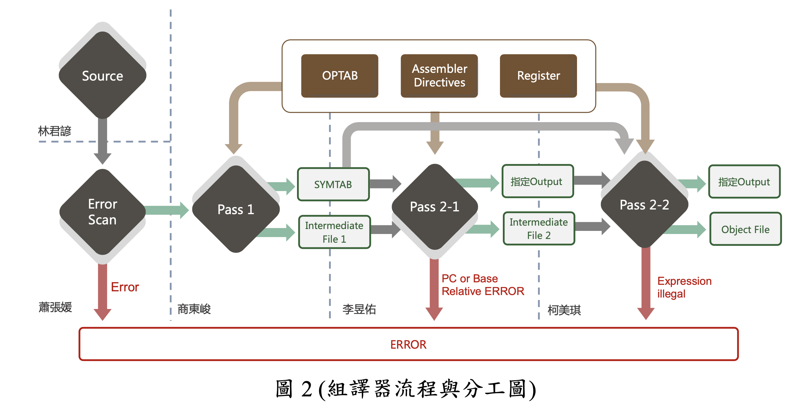
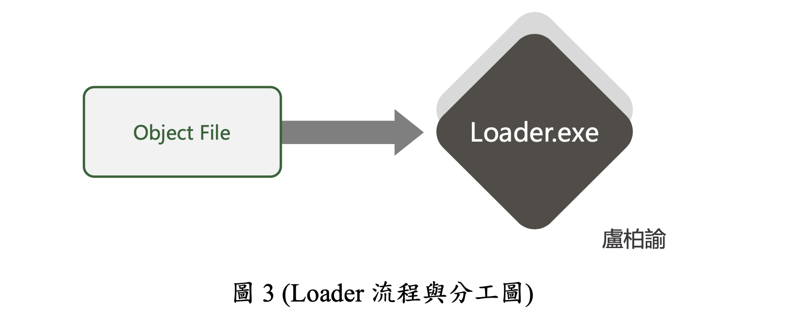

# NCYU System Programming Final Project
## 簡介
* 此專案為 Two Pass 的 SIX/XE 組譯器與 Loader
    * 組譯器使用 Python 撰寫，Loader 則是使用C++撰寫。
    * 在組譯器中，我們將 Two Pass 的組譯器拆成四個部分，並分配給四個組員撰寫。每個組員負責的部分都撰寫成 Python 中的 module，其中每個組員也會共用一些 modules，最後再將所有的 module 打包，變成一個 package。主程式再藉由 import package 來完成組譯的工作。
    * 而 Loader 則是使用 C++撰寫後，用 GDB 進行 DEMO。
* 詳細的設計與說明，可參考[書面報告](報告/書面報告.pdf)與[報告投影片](報告/投影片報告.pptx)
## 組譯器的使用方式
```bash
$ python sicasm.py <InputFile>
```
* InputFile 為要編譯的檔案名稱(需與sicasm.py放在同個目錄底下)或檔案路徑
* object program 會在同個目錄下輸出
## 組員
* 1092922 林君諺 (s1092922@mail.ncyu.edu.tw)
* 1092928 盧柏諭 (s1092928@mail.ncyu.edu.tw)
* 1093332 商東峻 (s1093332@mail.ncyu.edu.tw)
* 1094841 李昱佑 (s1094841@mail.ncyu.edu.tw)
* 1094842 蕭張媛 (s1094842@mail.ncyu.edu.tw)
* 1094908 柯美琪 (s1094908@mail.ncyu.edu.tw)
## 組員分工
* 
* 
## DEMO影片
1. [組譯程式的 DEMO 影片](https://www.youtube.com/watch?v=iQTWHDfh4Ec)
2. [Loader 的 DEMO 影片](https://youtu.be/GinfA8uS8vM)